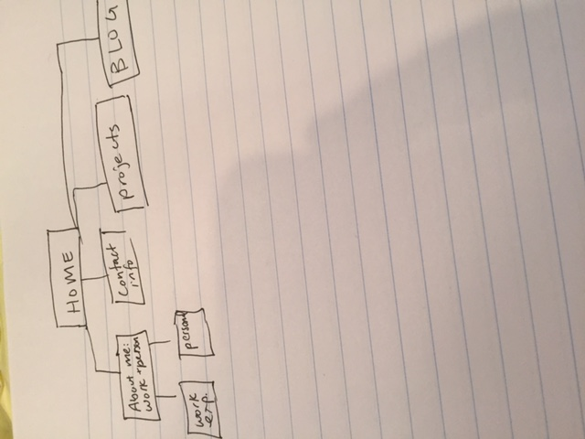

# What are the 6 Phases of Web Design?
Information gathering, planning, design, development, testing and delivery, maintenance
# What is your site's primary goal or purpose? What kind of content will your site feature?
My site's primary goal is to introduce me as a professional. My site will feature a blog, a short personal biography, a professional biography, contact information and a project portfolio.
# What is your target audience's interests and how do you see your site addressing them?
My target audience is potential clients, colleagues and potential employers so I want to make sure the content is updated regularly to keep them interested and make sure they want to visit my site often. My target audience will be interested in industry relevant blog topics. I want to make sure I update my blog often to keep them interested in visiting.
# What is the primary "action" the user should take when coming to your site? Do you want them to search for information, contact you, or see your portfolio? It's ok to have several actions at once, or different actions for different kinds of visitors.
I want visitors to see my portfolio, professional experience and to contact me.
# What are the main things someone should know about design and user experience?
The most important thing to understand about user experience is that it is not the same as usability. UX is all about how a person feels when using a site. Usability refers to how easy or user friendly a site is for a user. UX includes efficiency, utility and general preceptions of the system. Design is all about solving problems and a big part of solving problems is going through the process of solving those problems. When looking considering design, don't focus on the end result only. Make sure you consider the problem you're solving and at the end of implementing a solution, be sure to evaluate it.
# What is user experience design and why is it valuable?
<<<<<<< HEAD
User experience design is the process of designing based on improving user experience rather than designing based off of other models and client requests. This type of design is valuable because it focuses on the user and how the user interacts with a site as opposed to just following templates or mimicking sites a client likes. UX design is also problem focused. For example, design may negatively impact how much a user spends on an e-commerce site. A UX designer might aim to solve that problem by looking at the checkout process to see where users are getting hung up. From there, the designer can pinpoint the challenge and work on solving it to increase revenue.
# Which parts of the challenge did you find tedious?

I had one syntax error that was not allowing me to include my image. Finding that syntax error was tedious.
=======
# Which parts of the challenge did you find tedious?
>>>>>>> master
