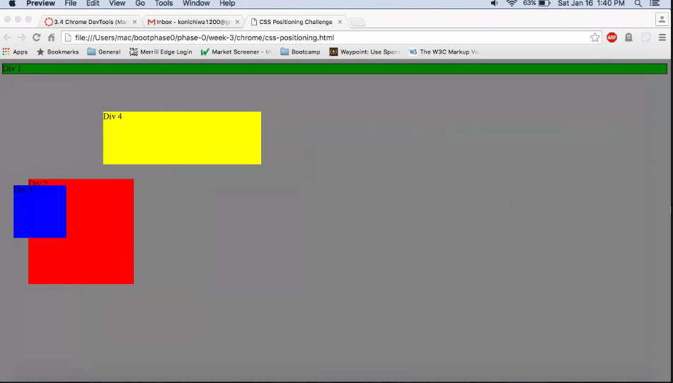
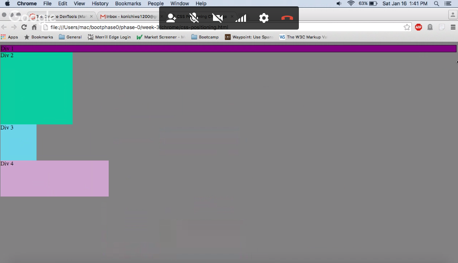
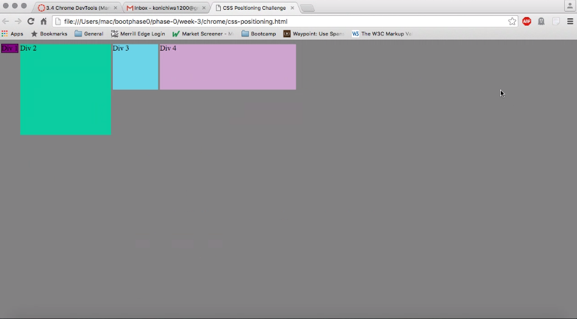
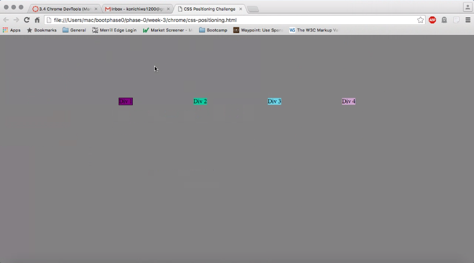
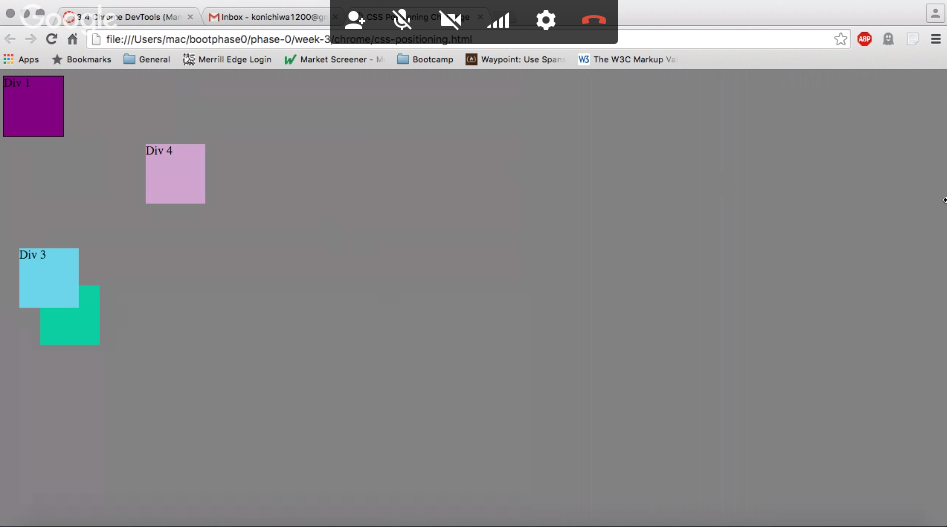
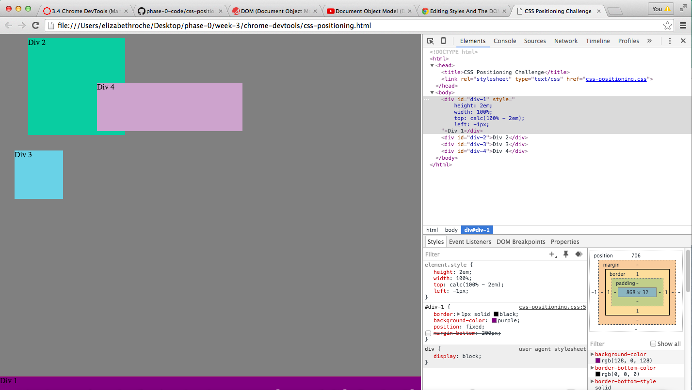
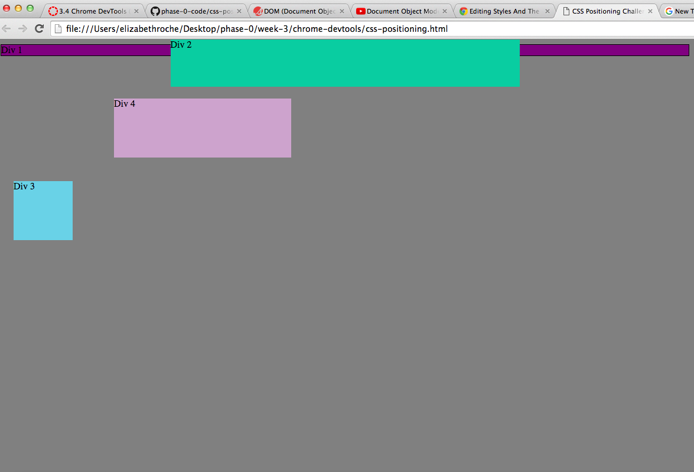
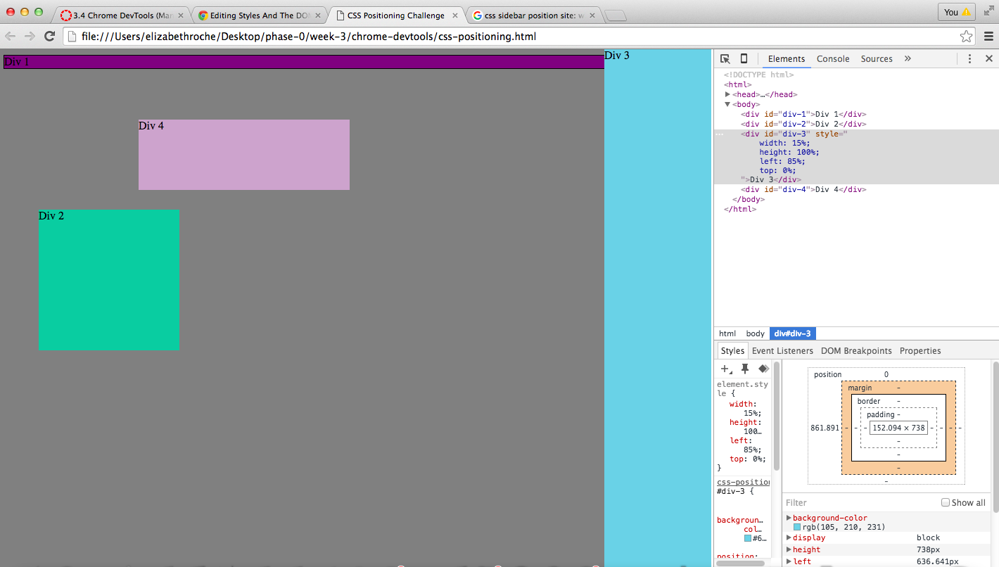
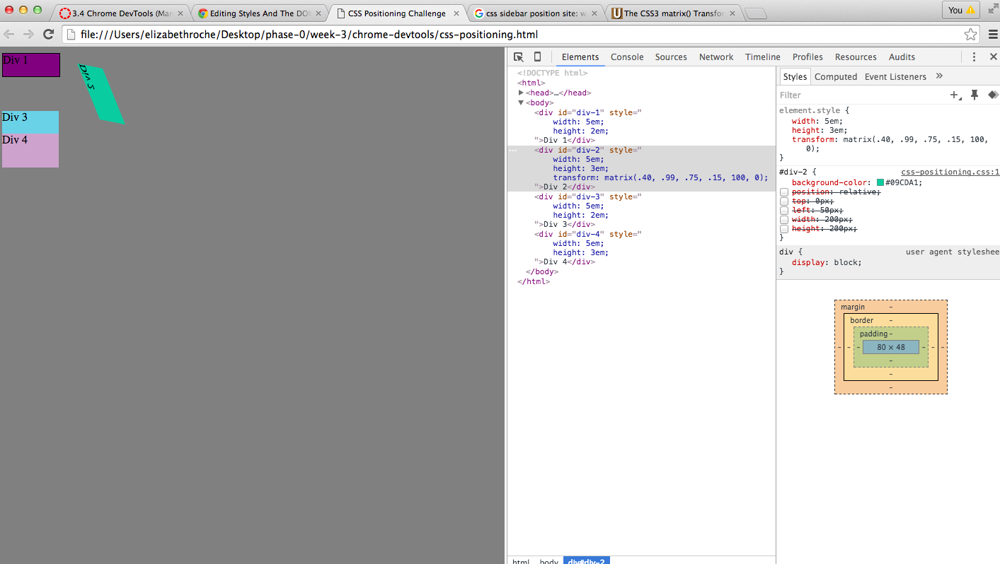

# How can you use Chrome's DevTools inspector to help you format or position elements?
You can use the inspector to see what CSS styling elements are currently being used and you can also add in new elements and see the page update in real time.
# How can you resize elements on the DOM using CSS?
We changed the height and width of our objects in order to resize them.
# What are the differences between absolute, fixed, static, and relative positioning? Which did you find easiest to use? Which was most difficult?
Static is the default positioning setting. Static just means that the object will appear as it normally would without any adjustments. Relative refers to relative to the object itself. If you set the positioning to relative, you can use top, bottom, right or left to move the object relative to where it normally would be without those direction positions. Absolute positioning let's us place an element anywhere on a page using the attributes top bottom right and left. Elements with absolute positioning are not affected by other elements and do not affect other elements. Fixed positioning is relative to the browser window. If an element has a fixed position, it will remain in the same place in the browser window even as the user scrolls.
# What are the differences between margin, border, and padding?
Padding is part of the element that you want to create space around. Even if you adjust other elements next to the element with padding, the space will still remain. Margins are outside of elements. Borders are how you style the border that surrounds the element.
# What was your impression of this challenge overall? (love, hate, and why?)
This challenge was okay. I found it to be a bit tedious and very hit or miss. That said, it was cool to use chrome devtools to manipulate the elements on the page. I also think there's a lot you can do with matrices to rotate objects on different axises.