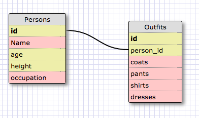

1. SELECT * FROM states;
2. SELECT * FROM regions;
3. SELECT state_name,population FROM states;
4. SELECT state_name,population FROM states ORDER BY population DESC;
5. SELECT state_name FROM states WHERE region_id=7;
6. SELECT state_name,population_density FROM states WHERE population_density>50 ORDER BY population_density ASC;
7. SELECT state_name FROM states WHERE population BETWEEN 1000000 AND 1500000;
8. SELECT state_name,region_id FROM states ORDER BY region_id ASC;
9. SELECT region_name FROM regions WHERE region_name LIKE '%Central';
10. SELECT regions.region_name, states.state_name FROM states INNER JOIN regions ORDER BY region_id ASC;

What are databases for?
Databases are used to store large amounts of related information or data sets.
What is a one-to-many relationship? A one-to-many relationship refers to when several things belong to another thing. For example, a person has 10 pairs of shoes. There is only one person who owns those shoes and all of those shoes only belong to one person.
What is a primary key? What is a foreign key? How can you determine which is which? A primary key is the id for an individual table and the foreign key is one that refers to the primary key. You can think of the foreign key as a link to the primary key. The primary key is always unique and the foregin keys which reference primary keys can be referenced in several parts of a structure.
How can you select information out of a SQL database? What are some general guidelines for that? Commands are always written in UPPERCASE while indentities are written in the lowercase.