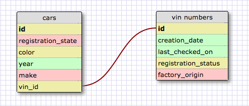
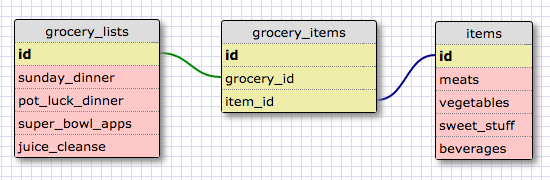

Release 2:

A car can only have one vin number and a vin number can only belong to one car. It is therefore a one to one relationship.
Release 4:

What is a one-to-one database? A one to one database is when you have two entities that have a exclusive relationship with one another. They are like a pair and they have a single relationship to eachother.
When would you use a one-to-one database? (Think generally, not in terms of the example you created). You could use a one to one database in order to separate some attributes that you might not access often but that belong to something. If you have an incredibly long list of attributes but a handful of attributes that you access regularly, you could take the long list of attributes you don't use and put it into another entity with a one to one relationship to the original entity. This way, you can keep all of the attributes but keep the vital ones on hand.
What is a many-to-many database? The best way to explain this is through an example. Let's say you have two entities - sales people and products sold. You have many different sales people and they're selling many different products. Conversely, you have many products all being sold by many different sales people. This is a many-to-many relationship.
When would you use a many-to-many database? (Think generally, not in terms of the example you created). Many-to-many databases are very commonly used. You could easily use them to organize items in a store, products sold by sales people, courses taught by teachers, etc. You would use this database anytime you have an entity with several different things belonging to several different things from another entity and vice-versa.
What is confusing about database schemas? What makes sense?
These things actually make quite a bit of sense. I think the most difficult part is explaining them without using examples!! The application of the one-to-one didn't make sense initially but now I can understand how you might want to "slice" one entity down and move non-essential attributes over to another entity with a single relationship to the original.